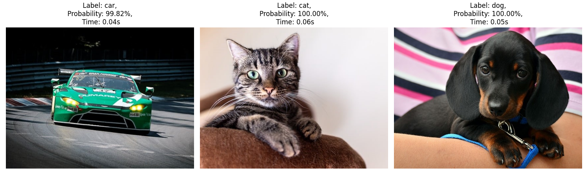

# MobileCLIP Zero-Shot Image Classification



This repository demonstrates how to perform zero-shot image classification using MobileCLIP, a lightweight variant of OpenAI's CLIP optimized for resource-constrained devices. With this script, you can classify images into categories (such as cat, dog, or car) without the need for traditional supervised training.

## Overview

The code in this repository:
- Loads the MobileCLIP-S1 model along with its preprocessing transforms and tokenizer.
- Loads input images using OpenCV and Pillow.
- Computes image and text features with MobileCLIP.
- Calculates the similarity between image and text features to predict the most likely label.
- Visualizes the classification results (image, label, probability, and processing time) using Matplotlib.

## Installation

### 1. Create a Virtual Environment (optional but recommended)

```bash
python -m venv venv
source venv/bin/activate  # On Windows use: venv\Scripts\activate
```

### 2. Install the Required Packages

Ensure you have pip updated, then install dependencies:

```bash
pip install -r requirements.txt
```

### 3. Install Torch with CUDA Support (optional)

For faster inference, especially if you have a GPU available, it is highly recommended to install PyTorch with CUDA support. CUDA-enabled PyTorch leverages your GPU to accelerate model inference.

#### Steps to Install PyTorch with CUDA:

Visit the [PyTorch Get Started Page](https://pytorch.org/get-started/locally/) to select your operating system, package manager, and CUDA version that is compatible with your GPU drivers.

For example, to install PyTorch with CUDA 12.4 support using pip, run:

```bash
pip install torch torchvision torchaudio --extra-index-url https://download.pytorch.org/whl/cu124
```

Verify your installation by executing:

```bash
python -c "import torch; print(torch.cuda.is_available())"
```

If the output is `True`, PyTorch is configured to use CUDA, and you should experience faster inference times.

## Usage

### 1. Prepare Your Data

Place the images you wish to classify in a folder (default is named `data`). Each image should be a valid image file readable by OpenCV.

### 2. Run the Script

The main classification script is named `mobileclip_classification.py`. You can run it with default settings or specify a custom data folder and labels.

#### Default Usage:

```bash
python mobileclip_classification.py
```

#### Custom Arguments:

- `--data_folder`: Specify the path to the folder containing input images (default is `data`).
- `--labels_list`: Provide a comma-separated list of labels for classification (default is `cat,dog,car`).

For example:

```bash
python mobileclip_classification.py --data_folder data --labels_list cat,dog,car
```

The script will process each image in the specified folder, classify it using MobileCLIP, and display the results along with processing time.